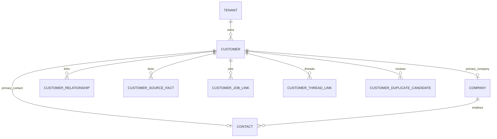

# Customer card domain — domain model

> Design document for todo B. Persistence is **provisional** until todo G implementation gate.

**Audit baseline:** `docs/customer-card-domain/current-truth.md` (2026-07-26)

---

## 1. Model alternatives evaluated

### Alternative A — Flat customer record (rejected)

Single table/schema with embedded name, email, phone, company, address fields.

| Pros | Cons |
|------|------|
| Simple queries | Cannot model company + multiple contacts |
| Fast to ship | No provenance or historical facts |
| | Collides with scattered job JSON fields |
| | Encourages overwrite instead of conflict handling |

### Alternative B — Customer aggregate + Company/Contact + source facts (recommended)

`Customer` as tenant-scoped relationship root; `Company` and `Contact` as separate entities; `CustomerSourceFact` as append-only provenance; `CustomerCard` as read projection.

| Pros | Cons |
|------|------|
| Matches audit gaps (company contacts, history) | More schemas and future tables |
| Aligns with fail-closed matching plan | Requires careful naming vs tenant account |
| Reuses job/thread IDs by reference | Projection logic deferred to todo H |
| Supports duplicate candidates without auto-merge | |

**Recommendation:** Alternative B — minimal CRM, not a full CRM.

---

## 2. Why this is not a large CRM

The model intentionally excludes: opportunity pipelines, marketing automation, contract lifecycle, ticketing ownership, ERP write-back as SoT, and global contact directories.

Scope is:

- who the end customer is (private or company),
- observed and verified identities,
- links to existing jobs/threads/approvals/actions,
- duplicate review without automatic merge,
- timeline references (todo D).

---

## 3. Terminology separation

| Entity | Meaning |
|--------|---------|
| Tenant | Platform customer (installation company) |
| Tenant account | Config + operator “customer” UI row |
| Customer | Tenant’s relationship to an end customer |
| Company | Legal/organizational party |
| Contact | Natural person |
| CustomerCard | Derived read model for UI |

---

## 4. Aggregate root and relations

**Aggregate root:** `Customer` (per `tenant_id`).

- Private end customer: `Customer` + primary `Contact`, `primary_company_id` null.
- Company end customer: `Customer` + primary `Company` + one or more `Contact` via `CustomerRelationship`.
- `Company` and `Contact` are entities inside the aggregate boundary; they are not interchangeable IDs.
- `CustomerSourceFact`, links, timeline events, and duplicate candidates hang off `customer_id` or owned subject (`company`/`contact`).

---

## 5. Source of truth vs projection

| Concern | Source of truth | Projection |
|---------|-----------------|------------|
| Verified contact data | `CustomerSourceFact` + `CustomerIdentity` with `verification_status` | `CustomerCard` fields |
| Display name | Derived from primary company/contact facts | `Customer.display_name`, card headline |
| Job/email content | Existing `jobs` table | `CustomerJobLink` reference only |
| Gmail payloads | Job `input_data` / history | `CustomerThreadLink` reference only |
| Duplicate decision | `CustomerMergeDecision` (future) | `CustomerCard.duplicate_status` |
| ERP customer number | Integration source fact | External identity on `Company` or `Customer` |

`CustomerCard` must not embed raw job, Gmail, or action payloads.

---

## 6. Invariants (contract phase)

1. Every tenant-owned record includes `tenant_id`.
2. Confidence ∈ [0.0, 1.0].
3. Timestamps are timezone-aware UTC.
4. Locked schemas reject unknown extra fields (`extra=forbid`).
5. Empty identity strings are not verified values.
6. `Company` and `Contact` use separate ID spaces and schemas.
7. `automatic_merge_allowed` default and requirement: `false`.
8. `automatic_link_allowed` default and requirement: `false`.
9. `supersedes_fact_id` cannot equal `fact_id`.
10. Identifiers (`customer_id`, `job_id`, etc.) are opaque strings in this phase.

---

## 7. Future persistence candidates (provisional — todo G)

| Concept | Likely table | Notes |
|---------|--------------|-------|
| Customer | `customers` | version column for optimistic locking |
| Company | `customer_companies` | tenant scoped |
| Contact | `customer_contacts` | tenant scoped |
| CustomerAddress | `customer_addresses` | owner_type discriminator |
| CustomerIdentity | `customer_identities` | normalized index per tenant |
| CustomerRelationship | `customer_relationships` | |
| CustomerSourceFact | `customer_source_facts` | append-only |
| CustomerTimelineEvent | `customer_timeline_events` | append-only |
| CustomerJobLink | `customer_job_links` | |
| CustomerThreadLink | `customer_thread_links` | integration context columns |
| CustomerDuplicateCandidate | `customer_duplicate_candidates` | |
| CustomerMergeDecision | `customer_merge_decisions` | append-only |

No ORM or migration is approved until todo G and operator sign-off for todo H.

---

## 8. Stop-gate (todo B)

| Condition | Result |
|-----------|--------|
| ORM required for contracts | **PASS** — Pydantic only |
| Migration required | **PASS** — not in B |
| New dependency | **PASS** — stdlib + Pydantic |
| Runtime coupling required | **PASS** — isolated package |
| Duplicates existing end-customer domain | **PASS** — none found |
| Tenant vs customer separable | **PASS** |
| Company/contact separable | **PASS** |

**Todo B stop-gate: PASS**
