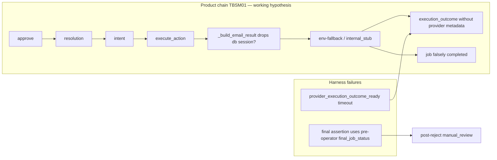

# Semi-auto provider dispatch finalization

## Context

Canary `30356438634` @ `b40d2de` (PR #87 merged, post-merge Release Gate `30355942339` PASS).

| Scenario | Phase ordering (PR #87) | Remaining failure |
|----------|-------------------------|-------------------|
| **TBSM01** (`5baef25a…`, job `28a54b77…`) | PASS | `provider_execution_outcome_timeout` — outcome=1, job `completed`, `gmail_mutations=0`, no `provider_message_id` |
| **TBSM04** (`61cda6ca…`, job `35603eba…`) | PASS | `assert_semi_automatic_campaign_pipeline` expects `awaiting_approval`, got `manual_review` |

PR #84 (recipient), #85 (metadata), #86 (approval lifecycle), #87 (phase ordering) must be preserved.

**Branch:** `fix/semi-auto-provider-dispatch-finalization`

**Working rules after plan approval:**

- Plan technical content is **read-only**; only todo status may change (`pending → in_progress → completed`).
- Do **not** commit `storage/status/*` or live artifacts.
- No changes to OAuth, secrets, recipient verification, approval materialization, or reply budget.



---

## A. Plan file and evidence report

Create local evidence report [`storage/status/semi-auto-provider-dispatch-30356438634.md`](storage/status/semi-auto-provider-dispatch-30356438634.md) (**not committed**).

**Sources:** user-verified canary snapshot, workflow logs/artifacts via `gh` if available, code audit @ `b40d2de`. CI PostgreSQL ephemeral → raw DB rows = `not_observed` unless artifacts contain redacted snapshots.

**Report sections:**

- Run metadata (workflow, SHA, scenarios, execution/job IDs)
- TBSM01 outcome forensics (all mandated fields; missing = `not_observed`)
- TBSM04 post-reject terminal state
- Integration-key audit across layers
- Dispatch chain first deviation point
- D-classification (**locked only after PostgreSQL reproduction** — see G)

---

## B. TBSM04/05/07 — post-reject assertion contract (harness only)

**Root cause:** [`runner.py`](app/evaluation/live/runner.py) passes `outcome.final_job_status` (pre-operator YAML) to final assertion. Post-operator poll already accepts `manual_review` via [`resolve_post_operator_success_statuses()`](app/evaluation/live/semi_auto_phase.py).

### Explicit YAML scenario fields

Add to scenario YAML `expected_routing`:

```yaml
post_operator_final_job_status: manual_review
```

**Scenarios:**

- [`TBSM04_lead_reject.yaml`](app/evaluation/live/resources/campaign/TBSM04_lead_reject.yaml)
- [`TBSM05_support_reject.yaml`](app/evaluation/live/resources/campaign/TBSM05_support_reject.yaml)
- [`TBSM07_stale_approve.yaml`](app/evaluation/live/resources/campaign/TBSM07_stale_approve.yaml)

Keep existing `final_job_status: awaiting_approval` as **pre-operator** contract only.

### Contract model ([`semi_automatic_expected_outcomes.py`](app/evaluation/live/campaign/semi_automatic_expected_outcomes.py))

| Field | Phase | TBSM04/05/07 reject |
|-------|-------|---------------------|
| `pre_action_job_status` / `final_job_status` | Pre-operator | `awaiting_approval` |
| `post_operator_final_job_status` | Post-operator final assertion | `manual_review` (from YAML) |

### Parser / readiness validation

[`resolve_semi_automatic_expected_outcome()`](app/evaluation/live/campaign/semi_automatic_expected_outcomes.py) and campaign readiness must verify `post_operator_final_job_status` is **compatible** with:

- operator plan `decision` (reject → `manual_review`; approve+reply → `completed`)
- `expected_reply` / reply budget (`gmail_replies: 0` for reject scenarios)
- expected pending/resolution/intent/outcome counts post-operator

Mismatch at parse/readiness time → fail closed (do not run scenario).

### Post-reject guard ([`assertions.py`](app/evaluation/live/assertions.py))

`manual_review` accepted post-reject **only** when simultaneously proven:

- explicit operator `reject` on target approval
- `action_approval_resolution` count = 1
- `pending_approval_count` = 0
- `execution_intent` = 0, `execution_outcome` = 0
- Gmail writes / replies = 0

Pre-operator `manual_review` without operator → `approval_bypass_or_phase_order_violation` (unchanged).

**Wire-up:** [`runner.py`](app/evaluation/live/runner.py) `_assert_all()` uses `post_operator_final_job_status` for `expected_job_status`.

**Product reject flow:** unchanged.

---

## C. Configuration precedence (locked invariant)

When a DB session is available:

1. **Tenant DB configuration is authoritative** for integration connection resolution (`resolve_google_mail_connection_config`).
2. **No silent env-fallback** to a different tenant or mailbox identity when DB session exists.
3. **Missing tenant integration** must be explicit and **fail-closed** (no stub masquerading as provider success).

Applies to [`get_integration_connection_config()`](app/integrations/service.py) call sites in [`action_executor.py`](app/workflows/action_executor.py), especially `_build_email_result()`.

---

## D. `internal_stub` invariant (locked)

`internal_stub` is **not** real provider success and must **not**:

- count as provider accepted
- make `provider_execution_outcome_ready()` pass
- count as Gmail mutation
- provide false execution evidence

Enforce in:

- [`provider_recipient_verification.py`](app/evaluation/live/provider_recipient_verification.py) — provider-ready gate
- [`external_write_trace.py`](app/workflows/external_write_trace.py) — outcome metadata semantics
- [`email_approval_resolution.py`](app/workflows/email_approval_resolution.py) — job finalization (`send_succeeded` must require real provider outcome, not stub `status: executed`)

---

## E. Integration-key audit

Audit layers for `send_customer_auto_reply`:

- tenant integration configuration
- [`action_authorization.py`](app/workflows/action_authorization.py) action-to-integration mapping
- dispatch integration gate ([`action_dispatch_processor.py`](app/workflows/processors/action_dispatch_processor.py))
- adapter registry
- Gmail client selection
- execution outcome metadata

Canonical keys via [`app/integrations/keys.py`](app/integrations/keys.py). Classify as `integration_key_contract_verified` unless live evidence proves alias mismatch (D2).

---

## F. TBSM01 dispatch chain

Trace on `b40d2de`:

```text
operator approve → approval resolution → resume → action authorization
→ execution intent → dispatch processor → integration gate → adapter registry
→ Gmail adapter → adapter result → execution outcome → provider metadata persistence
```

Report first deviation step.

---

## G. Root-cause classification

### Working classification (pre-reproduction)

**D5 — Synthetic/skipped outcome created** — lock only after hermetic/PostgreSQL reproduction.

### D5 lock criteria (all must be proven)

1. Tenant Google Mail OAuth exists in database
2. `execute_action(..., db=session)` receives DB session
3. `_build_email_result()` drops / does not pass session to connection config
4. Env-fallback or stub path is selected
5. Gmail adapter invoked **0** times
6. Outcome lacks provider metadata (`provider_message_id`, `adapter_recipient`)

If reproduction fails → document live-vs-fixture configuration delta before product changes.

Other D-classes (D1–D4, D6–D9) remain available if reproduction disproves D5.

---

## H. Hermetic / PostgreSQL reproduction (mandatory gate)

**Before product fix**, add PostgreSQL reproduction test proving DB-session drop:

- Seed tenant OAuth row (mock or fixture)
- `execute_action(..., db=session)` for `send_customer_auto_reply` after approve path
- Assert: Gmail adapter mock invocation = **0**, stub selected, outcome lacks provider metadata
- After fix: Gmail adapter mock invocation = **exactly 1**, provider message-ID and adapter recipient persisted, `provider_execution_outcome_ready()` = true

---

## I. Minimal bounded fix (after D5 lock)

### Primary (if D5 confirmed)

Pass `db` through `_build_email_result()` → `get_integration_connection_config(..., db=db)`.

### Required (invariant §D)

Ensure `internal_stub` cannot satisfy provider-ready gate or job `completed` for mandatory external-write reply actions.

**Forbidden:** OAuth/secrets changes, recipient verification weakening, approval materialization changes, reply budget changes, semi-auto product exceptions.

---

## J. Mandatory delivery gates

All must PASS before canary:

| Gate | Requirement |
|------|-------------|
| PostgreSQL reproduction | DB-session drop proven pre-fix; adapter mock = 1 post-fix |
| Stub guard | `internal_stub` invocation = 0 when tenant OAuth exists |
| Provider metadata | `provider_message_id` + `adapter_recipient` persisted |
| Provider-ready | `provider_execution_outcome_ready()` PASS |
| TBSM04/05/07 | post-reject `manual_review` assertion PASS |
| Pre-operator guard | `manual_review` before operator → phase violation |
| TBSM04 reject | 0 intents, 0 outcomes, 0 replies |
| PR #86 | approval lifecycle regression PASS |
| PR #87 | phase ordering regression PASS |
| PR #84 | recipient verification PASS |
| PR #85 | metadata persistence PASS |
| Live-eval | entire `tests/evaluation/live/` PASS |
| PostgreSQL live-eval | PASS |
| Approval regressions | approval/emailapproval PASS |
| 2E/2G | PASS |
| Docker | PASS |
| Release Gate | full PASS |
| Post-merge | Release Gate PASS after squash-merge |

---

## K. PR, merge, canary

1. Open PR on `fix/semi-auto-provider-dispatch-finalization`
2. PR body: source canary `30356438634`, P2/P4 verified, TBSM04 assertion-only, **locked D-classification**, outcome semantics before/after, config precedence, `internal_stub` invariant, no recipient/provider weakening, no full campaign
3. Squash-merge → post-merge Release Gate

### Canary (exactly one, after green post-merge gate)

| Scenario | Budget |
|----------|--------|
| TBSM01 | 1 authorized reply |
| TBSM04 | reject, 0 replies |

**Aggregate budget:** inbound sends = 2, authorized replies = 1, max reply per scenario = 1, unauthorized replies = 0, non-Gmail external writes = 0.

Environment approval via API only after green operator, foundation, readiness, integration, and budget gates.

---

## L. Stop rules

### Canary FAIL

- No further fix or canary without new mandate
- No full campaign
- `provider-final-d-bounded-fix` stays `in_progress`
- `testbot-e-automatic-campaign` = NO-GO
- Report first failing dispatch/provider/recipient step

### Canary PASS

- Do **not** run full campaign
- Stop with: **`OPERATOR ACTION REQUIRED — Auktorisera full semi-auto-kampanj efter verifierad provider-canary`**
- Report: final D-classification, reproduction evidence, PR, merge-SHA, post-merge gate, canary-run, TBSM01 adapter/provider/recipient chain, TBSM04 post-reject result, budget and safety gates

---

## M. Execution order (autonomous A → G)

1. **A** — Evidence report + forensics inventory
2. **C** — PostgreSQL reproduction; lock D-classification
3. **B** — TBSM04/05/07 harness contract (YAML + parser + assertions)
4. **D** — Minimal product fix (db session + internal_stub invariant)
5. **E** — Regression tests + all delivery gates + PR + merge
6. **F** — One TBSM01 + TBSM04 canary
7. **G** — Stop report per §L
